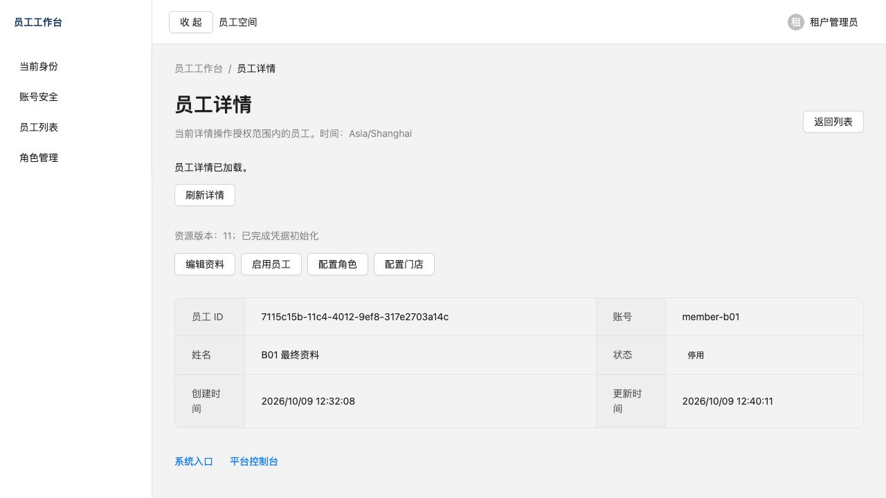

# B01 员工与授权管理集中验收

日期：2026-10-09。项目：`/Users/kimwell/work/pet-platform`。当前 **B01 COMPLETE**。本报告是本批唯一主要验收报告；原任务报告、失败日志和未执行边界保留。

## 交付与路线对应

在原工程、安全服务和冻结依赖上交付员工创建、姓名编辑、启用/停用、角色列表/详情/创建/资料及状态维护、逐权限数据范围、员工角色/门店授权、正式表单选项读取及 Web 表单。原六字段列表/详情、URL 查询、字符串 total、取消请求及身份代际清理继续复用。账号和角色编码创建后固定，无物理删除、行业业务、部门、岗位、联系方式、批量或导入导出。

后端继续使用 `com.pet.platform`，V6 为新迁移，V1～V5不修改。目标检查沿用受控 JPA；固定登记 SQL 写关系，可信上下文、RLS和同租户复合约束共同限制读写。管理资料单独投影，不改变旧 EmployeeView。角色、关联、授权/安全版本、撤销意图及管理事件同事务；失败全回滚，提交后复用 P05 可补偿会话清理。凭据初始化使用既有 PasswordService；重置、强制改密、全会话撤销使用 P05 正式服务。

| 原任务 | 本批对应与状态 |
| --- | --- |
| P07-01 | 员工读取 COMPLETE，原455项及历史证据保留；本轮完整回归 |
| P07-02 | 员工列表 COMPLETE，沿用原URL/Query/total/取消及清理机制 |
| P07-03 | COMPLETE；本批真实contracts:check退出0、10项通过，关闭原G13；原环境失败保留 |
| P07剩余员工/角色/授权管理 | 本轮B01实现并真实验收；不是增加一份平行开发路线 |
| P07组织/Organization及平台基础管理 | 原必选项保留并归B02；正式组织模型尚未实施，P07整体不提前关闭 |
| P05-03 | 复用安全服务，完整回归，不建立另一套密码/Token体系 |
| P08/P09/P10/P11/P12 | 归B03/B04/所选可选能力/B05，不由本批测试代替 |

权威 [ROADMAP](../development/ROADMAP.md) 已整理 B01～B05、旧编号映射、原必选项和可选能力启动条件。原A07-02批量部分失败与A07-01删除末页回退必须在B03正式文件生命周期/导出及页面模式补验，未因B01排除员工批量而删除。RabbitMQ/Outbox随B03实际长任务需求明确启用；通知/订阅消息随B04真实场景及合法授权配置启用；支付须明确需求、商户/证书/回调条件及单独授权。B05复验选择的启用/关闭组合。未选择的可选项不写PASS。

## 接口、权限和范围

下列前缀均为 `/api/admin`，精确字段/生命周期见 [EMPLOYEE-MANAGEMENT](../contracts/EMPLOYEE-MANAGEMENT.md#b01-员工与授权管理2026-10-09)。

| 方法与资源 | 独立权限 | 范围/关键检查 |
| --- | --- | --- |
| GET `/identity/users`、GET `/identity/users/{id}` | `identity:user:list`、`identity:user:detail` | 旧TENANT/STORES/SELF逐权限范围；原状态与六字段 |
| GET `/identity/users/{id}/management` | `identity:user:detail` | 管理投影；TENANT/全目标门店覆盖/本人SELF |
| POST `/identity/users` | `identity:user:create` | TENANT；规范化唯一账号，ACTIVE/无关联/首次改密 |
| PUT `/identity/users/{id}` | `identity:user:update` | 独立目标范围及完整覆盖；仅姓名；version |
| PUT `/identity/users/{id}/status` | `identity:user:enable` 或 `identity:user:disable` | TENANT/STORES完整覆盖；禁止本人/保护管理员；撤销旧身份 |
| PUT `/identity/users/{id}/roles` | `identity:user:roles` | 同租户ACTIVE非保留角色；逐权限可授予范围 |
| PUT `/identity/users/{id}/stores` | `identity:user:stores` | 同租户ACTIVE；操作范围与身份门店上限；重新检查全部角色 |
| GET `/identity/roles`、GET `/identity/roles/{id}` | `identity:role:list`、`identity:role:detail` | 独立TENANT读取；分页字符串total/稳定code,id |
| POST `/identity/roles` | `identity:role:create` | TENANT；唯一编码/ACTIVE/空权限；禁止保留编码 |
| PUT `/identity/roles/{id}` | `identity:role:update` | TENANT；姓名/状态/version；保护角色拒绝；关联员工失效 |
| PUT `/identity/roles/{id}/grants` | `identity:role:grant` | TENANT管理通道仍逐permissionCode核对授予上限；关联员工失效 |
| GET `/identity/permissions` | `identity:role:detail` | 正式权限目录及当前可授予范围，不授写权限 |
| GET `/platform/stores/options` | `platform:store:list` | 本租户ACTIVE，操作范围与身份门店上限交集 |
| PUT `/identity/users/{id}/password` | `identity:user:reset-password` | 复用P05密码确认/版本/强制改密/全会话撤销 |
| POST `/identity/users/{id}/revoke-sessions` | `identity:user:revoke-sessions` | 复用P05正式撤销及频控，不新建安全服务 |

同一权限的STORES与SELF可取并集；不同权限不能借用范围。TENANT可授该权限支持的范围，STORES只能授覆盖被授权员工全部门店的STORES，SELF不能转授另一主体。关系撤销也必须完整管理目标，不能接管高权限员工。所有正式DTO由生产OpenAPI生成，旧41个schema无修改（[实际比较](evidence/B01/schema-compatibility.json)）；公开路径21→30，增加13个操作。

保留管理员的新管理权限通过 [显式升级命令](../development/IDENTITY-BOOTSTRAP.md#b01-管理能力显式补充2026-10-09)补充，迁移/普通启动不自动赋权；运行账号和PUBLIC不得执行。无密码/Token的固定管理事件已原子落库，通用审计读取/检索/关联仍归B03。

## 真实业务链路

使用正式 Application、真实 PostgreSQL 17.11、Redis 8.2.10、Sa-Token与正式HTTP认证。浏览器运行正式生产服务类，test profile只提供隔离连接、回环地址和本地HTTP Cookie配置，无Mock Controller、身份Provider或业务页面。初始租户/管理员走正式bootstrap；第二门店及管理员门店关联为受控SQL环境准备；员工创建通过实际页面和正式接口完成。该证据不等于生产TLS/部署或真实性能验收。

1. 管理员正式Cookie登录；页面新建 `member-b01`，创建后version=0、ACTIVE、首次改密；页面编辑姓名。
2. 页面创建角色 `store-reader`，配置员工列表STORES、员工详情SELF；页面为员工配置第一门店和该角色。
3. 正式接口创建第二门店对照员工并配置第二门店；这只准备访问范围反例，没有替代页面创建验证。
4. 新员工正式Cookie登录，受限会话转账号安全。首次改密通过既有正式Token安全接口完成；旧Token与浏览器Cookie均失效。新密码重新正式登录。
5. 员工列表真实total=`"2"`，只有管理员与本人；第二门店对照员工不可见。本人详情200，管理员详情404。没有角色管理、创建、编辑、授权入口。
6. 管理员正式接口清空角色权限，旧员工Token401；重新登录后员工列表403。浏览器刷新旧详情回登录并清旧数据。
7. 管理员页面正式停用员工，旧Token401、新登录401 LOGIN_FAILED。
8. 最终数据库：员工 `DISABLED`、姓名 `B01 最终资料`、version=11、安全与授权代际已推进、首次改密标志false；保留1个角色关联、1个门店关联；角色权限0；会话清理待办0。

主链证据：[浏览器结果](evidence/B01/browser-results.json)、[正式API结果](evidence/B01/browser-api-results.jsonl)、[最终数据库](evidence/B01/browser-final-database.json)。补验数据库单独保存为 [draft-browser-final-database](evidence/B01/draft-browser-final-database.json)，没有覆盖主链最终状态。

## 关键反例与表单验收

新增 IdentityManagementIT 的14项均使用真实PG/Redis/HTTP，无业务替身。单元技术夹具与浏览器结果分别计数。

| 反例/操作 | 本轮实际结果与证据 |
| --- | --- |
| 无管理权限、读写独立 | 正式HTTP403；角色列表拒绝；员工浏览器无管理入口 |
| 跨租户目标/角色/门店 | 正式HTTP404，目标版本不变；数据库RLS拒绝跨租户写 |
| 缺某权限、SELF授TENANT、超门店上限 | 正式HTTP403/404；不借管理权限扩大另一权限 |
| 同权限并集、不同权限分开 | 正式列表STORES+SELF及详情SELF，集合/total分别核对 |
| 并发版本 | 两并发请求仅一个200、另一个409；浏览器真实409，草稿保留、保存禁用，显式读新版本后Tab/Enter成功提交 |
| 多步骤事务失败/数据库恢复 | 在真实PG管理事件INSERT注入失败；关系/安全版本/资源版本/撤销意图全部回滚；移除故障后同操作成功。不是整库断电/磁盘灾难恢复测试 |
| Redis故障及恢复 | 暂停本项专用真实Redis，正式写请求503且版本不变；恢复后写成功 |
| 网络故障及恢复 | 停本轮Vite，实际NETWORK提示；恢复后HMR重新读取，身份保留。没有网络替身 |
| 保护管理员/角色、本人授权修改 | 正式HTTP拒绝；Web不显示保护账号危险操作 |
| 精确字段错误 | 真实重复账号422，账号字段及总错误准确显示，临时密码已清空 |
| 敏感草稿 | 密码不进入Mutation变量/持久化状态；关闭/settled清密码；旧身份401时直接回登录并销毁表单 |
| 未保存内容 | 新建Modal关闭/角色页面离开可继续编辑或放弃；保留/清空及成功导航实际验证 |
| 桌面/390px/键盘 | 桌面真实列表/详情/表单；390px状态Modal宽374、无页面横向溢出；角色权限字段纵向布局；Tab/Enter、ArrowDown/Escape可用 |
| 连续操作与缓存 | 同步提交锁、pending/关闭动画禁用；正式创建/编辑/启停复验成功；成功更新相关Query；角色超末页仅一次replace回退 |
| P05重置及全撤销 | 正式HTTP调用、旧Token401、密码初始化标志核对，完整verify回归原安全测试 |
| 显式升级 | 指定租户9→17条，重复0，另一租户仍9；runtime/PUBLIC不可执行 |

浏览器结果文件有15条归组场景，不能当成15个JUnit测试，也不与原报告重复累计。全部命令记录见下节；截图 [冲突](evidence/B01/browser-version-conflict.png)、[字段错误](evidence/B01/browser-field-errors.png)、[390px角色表单](evidence/B01/browser-role-390.png)、[未保存提醒](evidence/B01/browser-unsaved-role.png)、[角色列表](evidence/B01/browser-role-list.png)。

## 集中命令与实际数量

检查的准确工作目录、命令参数、退出码、耗时及日志逐条保存在 [commands.jsonl](evidence/B01/commands.jsonl)，不以配置或历史数量替代执行结果。Maven任务顺序执行，避免契约导出与verify互相清理target。3条Vite长运行启动记录只有PID/STARTED，未单独捕获退出码，标为NOT_RECORDED；关闭依据实际端口及进程资源核对，不把启动记录算作检查PASS。

| 检查 | 工作目录 | 命令 | 本轮最终结果 |
| --- | --- | --- | --- |
| 后端完整 | `/Users/kimwell/work/pet-platform/apps/backend` | `./mvnw --batch-mode verify` | [退出0](evidence/B01/backend-verify-final-accepted.log)，146单元+323集成=469；失败/错误/跳过均0；原455+新增14 |
| Web类型 | `/Users/kimwell/work/pet-platform/apps/admin-web` | `pnpm typecheck` | [退出0](evidence/B01/web-typecheck-final.log) |
| Web lint | 同上 | `pnpm lint` | [退出0](evidence/B01/web-lint-accepted.log) |
| Web测试 | 同上 | `pnpm test` | [退出0](evidence/B01/web-test-accepted.log)，8文件254项，原244+本批10 |
| Web构建 | 同上 | `pnpm build` | [退出0](evidence/B01/web-build-accepted.log)；主入口723.66kB，既有500kB提示不隐藏 |
| 生成契约 | `/Users/kimwell/work/pet-platform` | `pnpm contracts:generate` | [退出0](evidence/B01/contracts-generate-final.log)，10项导出检查通过 |
| 契约一致性 | 同上 | `pnpm contracts:check` | [退出0](evidence/B01/contracts-check-final.log)，10项通过，生成产物一致 |
| 共享类型 | 同上 | `pnpm contracts:typecheck` | [退出0](evidence/B01/contracts-typecheck-final.log) |
| 小程序类型/lint | 同上 | `pnpm check:miniprogram` | [退出0](evidence/B01/miniprogram-types-final.log)；不等于DevTools/真机 |
| 仓库与空白 | 同上 | `pnpm check:repo`、`git diff --check` | [仓库退出0](evidence/B01/repo-accepted.log)、[空白退出0](evidence/B01/diff-check-accepted.log) |

[本次JUnit类/方法及实际数量](evidence/B01/backend-test-results.json)在契约命令清理target前保存；两次10项导出是重复运行的检查，不额外算作新增后端测试。生成脚本本轮另有3项技术测试通过。

冻结 Node24.21.0、pnpm10.34.6、Java21.0.12.1及原Wrapper/BOM。本轮Docker默认宿主转发曾超时；测试进程改用既有Docker引擎原始socket，未修改全局环境、代理配置或停重启既有容器。第二次verify另有刚启动的专用PG端口拒绝连接，12项初始化错误保留；后续检查仅在测试进程设置TESTCONTAINERS_HOST_OVERRIDE=127.0.0.1固定IPv4。固定IPv4后同类12项错误仍发生，未把该尝试写成解决。随后仅为旧JpaPersistenceIT配置Flyway最多3次连接重试；再次完整回归时该类通过，但旧AsyncTenantPersistenceIT首次JDBC连接失败、10条初始化错误保留（含类初始化错误，失败轮实际集成注册324项）。为它增加最多10次、间隔250ms的SQLState 08连接等待，不重试角色写入或断言。两类定向verify已实际通过15项结构+21项集成；不改生产配置、不跳过真实连接或任何断言，最终全量结果见命令日志。该调整不证明默认localhost转发已稳定，也不推断失败必然由IPv6引起。此前引擎不可用尝试保留，不把原socket证明为恢复。当前引擎真实容器服务用于上述测试。

证据等级分别记录：规则/映射为DOCUMENTED；冻结解析与生成类型为RESOLVED；编译/类型/构建为COMPILED；实际PG/Redis/HTTP及浏览器操作为RUNTIME_VERIFIED；未执行环境项为NOT_EXECUTED/NOT_VERIFIED。

## 失败保留及修复

- 初始Web lint未使用导入；契约生成的Docker连接挂起/引擎暂时不可用；旧Grant与新权限项schema同名导致类型漂移；字段错误NamePath类型问题。日志保留，改名PermissionGrant并增加旧Grant回归断言，未手改生成文件。
- 首轮完整verify的旧公开路径/身份函数数量断言失败，更新实际新增数量，同时继续核对函数owner、NOLOGIN、RLS、PUBLIC及runtime权限。
- 浏览器详情误展示未启用列表查询的错误、角色分页将query拼入路径、冲突提交按钮未禁用、快速重开Modal与动画竞争；分别修复并真实复验。角色分页新增实际请求层回归测试。
- 本轮重复创建管理员Token触发真实SESSION_LIMIT_REACHED；用既有正式退出全部设备服务清理本轮隔离账号会话，之后复用单一技术会话；没有改会话上限。
- 追加角色URL状态时React lint禁止同步effect setState，改用Router历史状态；HistoryState扩展模块名错误导致类型/构建失败，改用现有@tanstack/react-router声明方式。失败日志均保留。
- 最终审计初次汇总因Vite启动记录缺少exitCode而失败（[日志](evidence/B01/final-audit-first.log)）；改为明确区分检查退出码与长运行启动记录后汇总，未推定其退出码。
- 资源核对初次脚本以大小写敏感文本识别Docker的“no such object”，误把已删除容器记FAIL；改为不区分大小写后只读重验PASS。原失败记录保留，未为此操作既有资源。
- 500kB构建提示、Netty本机DNS回退及技术故障注入日志保留；无生产或外部成功结论。

## 文件与资源保全

完整[文件及SHA-256清单](evidence/B01/file-manifest.json)、[最终审计](evidence/B01/final-audit.json)与[272个既有跟踪文件保全比较](evidence/B01/preservation.json)可复核。变更集中于identity管理API/application/infrastructure、V6、显式命令、架构/迁移/契约回归与14项IT、Web管理模块/既有列表详情接入/路由、生成契约、权威路线及本报告。不会把本轮私有运行脚本或凭据纳入仓库。

两次专用后端/PG/Redis环境已关闭，本轮Vite及浏览器标签页已关闭；临时凭据/Token文件已清理，[只读资源核对](evidence/B01/cleanup.json)及[可复核脚本](evidence/B01/cleanup-check.py)已确认6个专用容器删除、3个端口无监听。[全部测试资源核对](evidence/B01/cleanup-all-tests.json)确认本轮日志涉及的134个专用容器均已删除，[浏览器核对](evidence/B01/browser-cleanup.json)确认本轮两个标签已关闭。主链DB快照保存在资源清理前；本轮未对既有卷/进程执行停机、删除或重建；既有UI、冻结依赖和旧迁移的跟踪文件比较保持不变。不提交、推送、发布或部署。

## 未完成项与下一批

**B01 COMPLETE；B02具备准入条件，仍NOT_STARTED，本轮未执行。** 本批必选员工授权链路已闭合，正式身份/迁移/生成契约及集中检查通过；P07整体仍IN_PROGRESS，待B02组织与B03页面模式条件补齐。B02需交付独立平台租户/最小门店控制面、原P07组织及组织页面正式模型/接口、平台授权与审计联调；现有权限目录不是这些管理API已经完成的证据。

B03通用文件/导出/审计、B04真实小程序使用端/真机、B05初始化工具及全新生成项目复验尚未执行。生产角色部署、TLS/代理/跨源、远程CI、Windows/Linux、真实辅助技术及容量/吞吐、实时撤权推送、整库灾难恢复仍NOT_EXECUTED/NOT_VERIFIED，保留原归属与证据边界。
