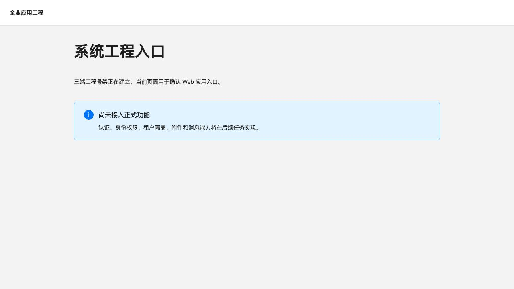

# P02-02 三端启动联调、环境配置校验与工程基础验收

日期：2026-10-08（Asia/Shanghai）。**P02-02 COMPLETE；P02整体 COMPLETE；P02-01历史COMPLETE保持；P03 NOT_STARTED。** 登录后的真实工具npm构建、源码编译、模拟器入口和预览权限已通过；用户反馈真机页面已打开且按钮正常。最新结果及完成判断见第13节。第1～12节保留各次历史观察、失败与NOT_EXECUTED，不倒改为PASS。

## 1. 前置事实、范围与事实源

已读取AGENTS、README、ROADMAP、VERSION-MATRIX、LOCAL-DEVELOPMENT、DECISION-LOG、P02-01报告、验收矩阵，核对当前结构/技术基线/配置/契约索引/OpenAPI规划、小程序原生配置、根命令、CI、Compose与三端源码。P01两个报告及第三方声明FAIL也已核对。用户本轮明确授权P02-02，替代AGENTS中“不自动执行P02-02”的自动推进限制，不自动执行P03。

| 前置事实 | 原始证据核对与本轮观察 |
| --- | --- |
| P01完成、P02-01 COMPLETE、P02 IN_PROGRESS | [P01-02](P01-02-VERIFICATION.md)、[P02-01](P02-01-VERIFICATION.md)及当前路线一致，未改旧报告 |
| main尚无提交 | [git-before](evidence/P02-02/git-before.json)：No commits yet；所有既有工程/UI未提交，未提交/推送 |
| 后端/Web/mini静态检查已通过 | P02-01 backend-verify/check-root-r3原日志/XML已核对；只因本轮修改重验必要检查 |
| 三服务原启动/连接通过，容器已停、卷保留 | P02-01 infra-start/infra-smoke/runtime-final-r2原记录；本轮[容器基线](evidence/P02-02/container-baseline.json)和[卷基线](evidence/P02-02/volumes-before.json)一致 |
| 微信真实编译未执行 | 公共AppID空、无私有配置；[当前工具](evidence/P02-02/wechat-environment.json)仍低于矩阵目标 |
| Web单chunk约689kB | 旧web-build-r2日志及本轮[实际包分析](evidence/P02-02/chunk-baseline.json)：689219字节、gzip228027字节 |
| RabbitMQ停止137 | P02-01 infra-stop/rabbit-stop-investigation/graceful-shutdown/exit-final原证据逐层核对，见专项 |
| P01上游完整声明FAIL保留 | Web TS2430、TDesign TS2344未修复；strict源码+skipLibCheck既定边界未变 |

本轮开始保全600个源文件及历史证据，见 [清单](evidence/P02-02/inventory-before.json)。没有整体移动目录、覆盖ui、读取/引入Product Delivery OS、创建enterprise-app-scaffold子目录、真实账号或秘密。依赖版本、根锁、后端固定package均保持。没有正式API/数据库应用集成/业务表/迁移/认证/多租户/业务页面或假健康接口。

等级分别记录：DOCUMENTED为本轮配置/开发说明，RESOLVED复用P02-01实际依赖树并核对本轮工具归档SHA，COMPILED为Wrapper/类型/构建，RUNTIME_VERIFIED仅指本报告明确的HTTP/浏览器/服务连接场景；微信工具/真机/远程CI等为NOT_VERIFIED。

## 2. 实际修改

- 后端：公开origin补端口范围校验；base/prod未填变量以空输入交给现有中文校验，避免未解析占位符先触发URI转换错误。空输入不提供开发或生产回退；启动校验禁止local/test/prod混用及profile与pet.environment不一致。有效配置、启动类和技术体系不变。
- Web：增加仅dev读取的origin验证，拒绝空值、非法协议、凭据/路径/查询/片段；增加根preview:web与应用preview命令，固定回环4173/strictPort、显式无开发代理。加入必要配置反例测试。
- chunk：移除当前无调用者的Ant Design App上下文，只保留官方中文ConfigProvider与Query provider。没有提高警告阈值、增加依赖或复杂拆包。
- infra：RabbitMQ显式30秒停止宽限及固定hostname；新增轻量local-infra脚本复用Compose解析、端口错误定位、停止后核对容器主进程退出码/OOM。非零失败继续传播，CI配置使用同一根check:infra。
- 更新README、本地说明、路线、决策、验收矩阵、配置/结构及infra说明，新增本报告与原始证据。小程序源码没有修改。

逐文件变更、保全及秘密/引用检查见 [最终审计](evidence/P02-02/final-audit.json)，没有删改P01/P02-01原始失败。

## 3. 三端实际启动、访问与停止

后端以冻结工具链在apps/backend执行 `./mvnw spring-boot:run -Dspring-boot.run.profiles=local`。最终配置的[启动日志](evidence/P02-02/backend-dev-r3.log)显示local、8080和真实Tomcat启动；根路径及未知路径真实HTTP404，见 [HTTP](evidence/P02-02/backend-http-r3.json)。没有Actuator/健康端点，验证强度为真实启动日志+监听+HTTP，并非数据库或业务健康验收。端口占用会退出1并明确8080已占用。对本轮独立进程组发SIGTERM，日志显示优雅停止，端口关闭且ps无活动进程，见 [停止观察](evidence/P02-02/backend-dev-r3-stop.json)。长驻启动/信号停止不伪造命令退出0。

Web以根dev:web启动回环5173。真实浏览器检查入口中文文字/样式、未知/missing/deep、深层刷新、返回链接，见 [交互记录](evidence/P02-02/web-browser.json)。当前只有/有效路由，深层路径是NotFound，不造业务路由。中文ConfigProvider由代码及现有测试核对，没有挂载日期/分页控件来冒充其专项运行检查。console warn/error记录为空；产物实际JS/CSS HTTP200，未观察到页面加载错误。没有业务网络请求或正式API联调。

开发/api保留路径，真实请求/api/p02-02-missing透传后端JSON404，见 [原始HTTP](evidence/P02-02/startup-http.json)。没有临时健康或假业务接口。build后以preview:web启动回环4173，入口、深层未知路由刷新与返回链接通过，静态资源路径为/assets/...，见 [资源检查](evidence/P02-02/production-assets-http.json)。preview不继承开发代理；生产需要站点根路径的SPA fallback，未来/api独立反向代理、/assets缺失返回404。**Vite preview通过不等于生产部署验收**，子路径部署未验证。

Web dev/preview以本轮进程组SIGTERM结束，监听端口关闭、无遗留，见 [dev停止](evidence/P02-02/web-dev-stop.json)、[preview停止](evidence/P02-02/web-preview-stop.json)。浏览器临时页已关闭。

小程序没有启动运行时。本轮只做实际可用的静态/离线构建检查，工具编译与真机状态见第7节。

## 4. 配置与基础设施

完整必填/可选变量、默认值、输入优先级、端口、数据目录、API代理和AppID入口在 [本地开发](../development/LOCAL-DEVELOPMENT.md#当前实际配置来源)。示例不生成密码；新环境按说明自行填写本地专用值。Java不加载.env；Vite DEV配置不公开；Compose默认env-file及临时覆盖入口明确。没有当前实现用途的数据库/微信/附件配置仍属于后续阶段。

配置反例真实执行，见 [反例汇总](evidence/P02-02/configuration-negatives.json)与 [脚本](evidence/P02-02/config-negatives.py)：无profile、prod缺origin、prod使用HTTP、非法公开来源/端口、端口占用均拒绝启动。生产混用profile专项先实际复现prod,local仍会以local默认启动，保留[FAIL观察](evidence/P02-02/profile-mix-before-observation.json)；增加启动校验后，混合profile和prod+local环境覆盖分别退出1，见[混用反例](evidence/P02-02/backend-profile-mix-after.json)、[环境覆盖反例](evidence/P02-02/backend-profile-mismatch-after.json)。Web缺可选变量使用公开本地默认，显式空值/错误来源不回退；凭据反例仅打印中文配置名，不打印夹具值。Compose六项必填分别清空均失败并指出变量；四项非法端口通过根脚本定位具体变量，见infra-port-named-r2-*记录。测试仅临时进程变量，不覆盖用户本地文件。

启动前Docker daemon可用，检查本项目既有容器/卷及其他资源标签、回环端口，见docker-info/ports-before/containers-before/volumes-before。日常infra/local/.env不存在，本轮复用P02-01的公开技术夹具 .local-data/p02-infra.env 与实际项目pet-platform-p02-validation，端口25432/26379/25672/25673；未改用户秘密配置。默认项目pet-platform-local端口仍15432/16379/15672/15673，所有映射127.0.0.1。

修复后的实际根命令start等待三服务healthy。PG通过宿主映射端口TCP密码认证执行SELECT，Redis同路径认证PING=PONG、无认证NOAUTH；RabbitMQ diagnostics与用户认证、AMQP 0-9-1真实SASL握手/vhost打开/正常关闭、management无认证401/认证200通过。AMQP未声明队列或发布消息。探针及记录见 [infra-smoke-hostname](evidence/P02-02/infra-smoke-hostname.json)、[探针源码](evidence/P02-02/infra-smoke.py)。**依赖服务连接通过不等于后端已经集成数据库、Redis、AMQP。**

所有已有卷在最终仍保留，三个本项目容器停止且主进程0；RabbitMQ仅为应用配置变更重建，其他项目容器/卷未删除或停止。最终[容器](evidence/P02-02/containers-final-r2.json)、[卷](evidence/P02-02/volumes-final-r2.json)与基线比较见审计。原技术卷旧Rabbit节点目录保留；见专项节点名边界，不声称消息数据迁移/恢复已验证。

## 5. RabbitMQ 137专项

| 层次 | P02-01原始事实 | 本轮补充与结论 |
| --- | --- | --- |
| Compose stop命令 | exit0，约1.62秒 | 本轮复现仍命令0；不能据此判主进程正常 |
| Rabbit主进程 | 原首次137，OOMKilled=false | 本轮原容器StopTimeout=1；事件signal15后1.018秒signal9、die137，无oom事件；日志已接收SIGTERM并开始停服务 |
| rabbitmqctl shutdown exec客户端 | exit137，日志Waiting for PID1 | 原最终inspect显示主进程0；客户端与节点退出层次不同。节点关闭后exec被结束，不能把该137当节点OOM；原FAIL保持，本轮正常停止不使用这个客户端 |
| 宽限修复 | 原未显式配置 | stop_grace_period=30s，实际inspect30；正常节点约1.4秒退出0，无signal9/oom；不增加内存/CPU要求 |

定位证据为 [原容器inspect](evidence/P02-02/container-baseline.json)、[复现Docker事件](evidence/P02-02/rabbit-stop-events.log)、[复现节点状态](evidence/P02-02/containers-stopped.json)、[关闭日志](evidence/P02-02/rabbit-stop-log.json)、[修复后事件](evidence/P02-02/rabbit-stop-r2-events.log)及 [最终事件](evidence/P02-02/rabbit-stop-final-events.log)。Docker stop先发送停止信号、宽限到期再SIGKILL的机制见 [官方说明](https://docs.docker.com/reference/cli/docker/container/stop/)。因此本轮直接原因为**实际1秒宽限不足导致强制终止**，不是由137猜测OOM。原容器1秒设置的历史来源没有足够证据追溯，未声称已查明谁或哪条命令设置了它；历史事件读取尝试143保持FAIL，当前实时事件是定位依据。

旧shutdown客户端命令参考 [RabbitMQ官方手册](https://www.rabbitmq.com/docs/man/rabbitmqctl.8#shutdown)；主进程0与客户端137分别记录，不忽略非零码。事件中Action=kill/signal15是Docker stop发送信号记录，本轮没有执行docker kill作为正常停止。

新stop脚本对原异常已停止容器实际返回1，见 [异常检测](evidence/P02-02/stop-abnormal-detection.json)；最终stop返回0且逐容器exited/0/false，见 [完整停止链路](evidence/P02-02/final-stop-chain.json)。没有把所有非零码忽略，也没有删FAIL。

重建还揭示默认节点名随容器ID改变：旧日志rabbit@2ccb...与第一次重建rabbit@ded5...使用不同节点目录。固定hostname=rabbitmq后，明确强制重建两次容器ID不同，但节点名均rabbit@rabbitmq、同一named volume，见 [前节点](evidence/P02-02/rabbit-node-name-before.json)、[后节点](evidence/P02-02/rabbit-node-name-after.json)与rabbit-identity-before/after记录。旧验证目录保留，没有迁移或删除。对既有真实消息数据切换节点名不能假定自动恢复；本轮只验证工程配置与认证，不进行消息数据恢复验收。

## 6. Web chunk评估

通过Vite/Rollup实际生成bundle读取每个rendered module，记录输出路径、import关系、原始字节及同一gzip算法结果，见 [原包](evidence/P02-02/chunk-baseline.json)、[最终包](evidence/P02-02/chunk-final.json)。renderedLength是minify前模块贡献指标，不把它等同压缩后单包字节占比。

| 输出 | 原始/minified体积 | gzip体积 | 结论 |
| --- | --- | --- | --- |
| 修改前 | 689219 bytes，689.22kB | 228027 bytes，228.03kB | 一个入口chunk，超过500kB警告阈值 |
| 修改后 | 621320 bytes，621.32kB | 206364 bytes，206.36kB | 原始减少67899 bytes（9.85%），gzip减少21663 bytes（9.50%）；构建退出0，警告仍保留 |

来源主要为React DOM、Ant Design及其组件/样式依赖、TanStack Router/Query。当前源码使用按名组件引用，无import *式全量库导入；Zustand未引用，bundle无其有效模块。移除没有使用者的App上下文确有收益，仍保留官方中文配置与Query能力。剩余基本成本与当前已渲染组件相符；没有真实多业务路由，当前不造页面拆包或大量微小chunk。警告不自动构成工程FAIL，也未做实际性能目标验收；P06/P07有业务模块时按既有代码路由dynamic import并重新衡量首次加载。

功能通过14项Web测试、实际入口/NotFound/返回及生产预览；输出JS中未发现DEV_BACKEND_ORIGIN、基础设施凭据键或配置反例字符串。没有新增VITE秘密配置。

## 7. 小程序检查范围及完成阻塞

| 项目 | 结果 / 等级 | 证据与边界 |
| --- | --- | --- |
| TypeScript | PASS，exit0 / COMPILED | root-check-final-r2实际tsc --noEmit；不是TS运行产物 |
| lint | PASS，exit0 | 同一聚合链，0错误/警告 |
| 原生配置/页面/组件引用 | PASS | project.config/public/private示例、miniprogramRoot、TS noEmit/plugin、npm关系、page四文件、TDesign引用均核对 |
| 离线官方组件构建 | PASS，exit0 / 限定构建场景 | miniprogram-ci 2.1.48隔离工具packNpmManually，1包、warnList=[]、1177文件实存并记录SHA；[日志](evidence/P02-02/mini-offline-npm.json)、[清单](evidence/P02-02/mini-npm-output-manifest.json) |
| 微信工具npm构建 | NOT_EXECUTED / NOT_VERIFIED | 本机2.01.2510260低于冻结2.02.2608080，无实际AppID |
| 微信工具真实编译/模拟器 | NOT_EXECUTED / NOT_VERIFIED | 同上；不能用离线组件或源码类型替代 |
| 真机 | NOT_EXECUTED / NOT_VERIFIED | 缺AppID/目标工具/设备运行条件；完整业务真机验收属于P09 |

工具/基础库版本没有降级或升级，不自动改全局微信工具，不编造AppID，不加入miniprogram-ci主依赖，不反复执行必然失败CLI。最小人工补齐步骤：按矩阵在本机准备目标工具→私有配置填写实际授权AppID→导入apps/wechat-miniprogram→工具构建npm→真实编译/点击入口按钮→保存版本/日志/截图；真机另记实际结果。无需向聊天提供AppSecret或真实秘密。

完成判断依据当前冻结P02“三端可独立构建”和既有P02-02目标工具npm/编译范围：[路线](../development/ROADMAP.md)。源码noEmit+离线组件不产生小程序源码可执行编译证明，因此**当前是完成阻塞，不能临时降成发布限制**。P01验收矩阵A09-01的真机业务验收仍归P09，没有新增提前业务验收门禁。

## 8. 实际命令、退出码与结果

所有详细argv、cwd、实际退出码、预期退出码、摘要与日志见 [命令索引](evidence/P02-02/all-command-records.json)。下表省略冻结工具绝对PATH；默认cwd为根，Wrapper为apps/backend。技术夹具/临时路径以原记录为准，非真实业务账号。

| 检查 | 实际命令 | 退出码 | 结果 |
| --- | --- | --- | --- |
| 后端最终构建 | ./mvnw clean verify | 0 | PASS；2 tests，0失败/错误/跳过；无IT，不宣称DB集成 |
| 根最终check | pnpm check | 0 | PASS；仓库/mini配置、Web typecheck/lint/14tests、mini typecheck/lint |
| Web build | pnpm build:web | 0 | PASS；621.32kB单包，警告保留 |
| 工程脚本lint | pnpm exec eslint scripts eslint.config.mjs --max-warnings=0 | 0 | PASS |
| 原生离线npm | node docs/testing/evidence/P02-01/pack-api.cjs | 0 | PASS；路径是原隔离工具，非微信工具编译 |
| infra配置/启动 | pnpm check:infra / dev:infra --env-file .local-data/p02-infra.env --project pet-platform-p02-validation | 0 / 0 | PASS；实际Compose及三服务healthy |
| 认证探针 | python3 docs/testing/evidence/P02-02/infra-smoke.py | 0 | PASS；PG/Redis/RabbitMQ，未作应用集成 |
| hostname重建 | Compose up -d --wait --wait-timeout 180 --force-recreate rabbitmq | 0 | PASS；同卷、不同容器ID/相同节点名 |
| 最终infra停止 | pnpm stop:infra --env-file .local-data/p02-infra.env --project pet-platform-p02-validation | 0 | PASS；三个主进程0，无强制终止 |
| 长驻后端/Web/preview | Wrapper spring-boot:run / pnpm dev:web / pnpm preview:web | 不适用启动完成码 | 启动与正常停止观察PASS；无活动进程，未伪造进程exit0 |
| HTTP/浏览器 | startup/runtime与CUA真实页面步骤 | HTTP探针0；浏览器不适用 | PASS；404/200、资源200、截图与交互 |
| 后端配置反例 | java -jar <实际产物>及临时公开输入 | 每项1（预期） | PASS反例；拒绝错误配置/占用/profile混用与环境覆盖 |
| Web配置/占用反例 | pnpm dev:web / preview:web +临时变量 | 每项1（预期） | PASS反例 |
| Compose缺必填 | Compose config --quiet +单项空变量 | 每项1（预期） | PASS反例；字段名明确 |
| Compose非法端口 | 原生Compose config --quiet | 每项15（预期） | PASS反例；初始原生只报hostPort |
| 根非法端口 | pnpm check:infra +临时变量 | 每项1（预期） | PASS反例；具体四项变量，Node原生15由pnpm包装为1，失败不吞掉 |
| CI同命令配置 | pnpm check:infra --env-file infra/local/.env.example +CI公开夹具 | 0 | PASS；仅本地配置，远程CI NOT_EXECUTED |
| 文档/保全审计 | python3 docs/testing/evidence/P02-02/audit.py | 0 | PASS；引用、保全、单锁、秘密特征与最终资源 |

## 9. 失败尝试与保留证据

本轮旧隔离目录pnpm分发/jdk部分文件被清理，最初pnpm/java各exit1，保留tool-pnpm/tool-java日志；从原固定分发归档恢复到本轮临时目录，SHA与P01原下载一致，后续目标版本命令0。没有换版本或改全局配置。

新Vite配置首轮TypeScript把条件空proxy推断为含undefined字段，root-check/build各exit2；以官方ProxyOptions明确索引类型修复，最终0，原日志保留。首轮配置探针断言期望先提示environment，实际Spring先在未解析origin占位失败，记录器exit1保留；使用现有中文构造校验后全部预期反例通过。

端口错误首轮记录器误把根pnpm预期码设为Docker的15，实际pnpm为1，因此四条infra-port-named-*保留FAIL；这不是错误被吞掉。后续按实际层次重新验证并记录infra-port-named-r2-*为PASS反例。原P02-01 Rabbit停止/exec失败、P01 vendor声明失败全部原样保持。生产混合profile实际启动的本轮FAIL观察同样保留，修复后以当前Wrapper重新verify、local启动/停止及两个配置反例通过。

## 10. G01～G16

| Gate | 结果 | 证据与限制 |
| --- | --- | --- |
| G01 P02-01报告/代码核对 | PASS | 原始日志/XML/配置与现状核对 |
| G02 配置与说明一致 | PASS | 必填/默认/生产区别/错误字段/临时变量反例、文档审计 |
| G03 infra真实启动连接 | PASS | healthy、PG/Redis/RabbitMQ真实认证连接 |
| G04 卷保留/资源无破坏 | PASS | 全部卷保全，只有本轮验证项目启动/停止；旧节点目录不迁移 |
| G05 Rabbit停止定位/边界 | PASS | StopTimeout1、signal15→9、137、非OOM；30秒后0，无强制终止；历史来源未知 |
| G06 后端真实启动停止 | PASS | Wrapper local、8080、真实404、SIGTERM优雅停止无遗留 |
| G07 Web dev及路由 | PASS | 真实CUA入口/NotFound/深层刷新/返回，开发代理404 |
| G08 Web build/preview | PASS | build0，真实预览/资源/路由；非生产部署 |
| G09 chunk依据评估 | PASS | 实际模块/体积分析，9.85%收益，500kB警告保持 |
| G10 mini静态/组件 | PASS | typecheck/lint/离线pack实际产物 |
| G11 微信/真机如实记录 | PASS（记录完整） | **工具npm/真实编译/真机均NOT_EXECUTED**；目标工具编译仍是冻结完成条件的阻塞，不将能力标PASS |
| G12 根命令与CI配置 | PASS | 同命令本地执行/YAML校验；远程CI未运行 |
| G13 当前改动所需检查 | PASS | 最终Wrapper/check/build/脚本lint/配置反例/启停均通过 |
| G14 无新增真实秘密 | PASS | 忽略规则/增量审计/客户端产物限定检查；未填真实AppID或密码 |
| G15 文档与证据完整 | PASS | 当前报告、命令索引、manifest、源码与引用/保全审计 |
| G16 未提前正式功能 | PASS | 无Controller/业务表/迁移/CRUD/认证/租户/假健康或Mock页面 |

G11的PASS仅说明“状态如实记录”要求，不能将未执行编译能力转换为PASS，也不能由16条记录性门禁推导已满足路线全部完成条件。目标工具真实编译未执行，因此P02-02保持BLOCKED。

## 11. 当前问题、影响、状态与下一合法工作

- **完成阻塞**：目标微信工具npm构建/真实编译NOT_EXECUTED。准备目标工具与本地真实AppID后补齐，不能由本轮离线输出关闭。
- **已解决本轮问题**：Rabbit过短宽限、停止码掩盖、节点名不稳定、生产profile混用/环境覆盖、Web代理来源格式/预览命令、无用途App上下文。历史停止1秒设置来源未知；旧Rabbit节点目录保留，未验证消息迁移。
- **保留限制**：P01完整vendor声明FAIL；621.32kB chunk警告；日常infra .env待开发者填写。当前源码基线内构建通过，未做性能或生产验收。
- **NOT_EXECUTED**：真机/预览上传/发布、远程CI、Windows/Linux工具链、正式DB/Flyway/JPA/Testcontainers应用集成、认证/租户/附件/消息/微信能力；按各自阶段处理，不把容器健康当业务PASS。

**P02-02 BLOCKED，P02整体IN_PROGRESS。** P02-01历史COMPLETE不变。当前下一合法工作是补齐P02-02的外部工具编译证据并复核相应完成条件；P03不能提前开始。P02全部实际任务完成后，下一阶段为 **P03 后端协议与数据基础**，首任务建议 **P03-01 统一响应、异常、字段错误与分页协议实现**，本轮未执行。

[证据manifest](evidence/P02-02/EVIDENCE-MANIFEST.json)保存文件大小/SHA（排除manifest自身）。所有本轮进程已停止，现有卷与ui/P01/P02-01证据保留；未提交、推送、发布或部署。

## 12. 2026-10-08 微信构建续验：工具/AppID已准备，登录仍阻塞

本轮用户提供AppID `wx9bcab67d52e2ee04`，授权仅关闭P02-02微信构建阻塞。重新读取AGENTS、版本矩阵、路线、本地说明、当前报告和验收矩阵，核对实际配置与git。无提交的main及既有未跟踪成果保持；不修改ui、后端/Web/infra源码，不开发登录/支付/业务，不升级冻结依赖，不进入P03，不提交/推送/发布。证据位于 [本次续验目录](evidence/P02-02/wechat-2026-10-08/)。

### 12.1 AppID和工程配置

- 实际AppID仅写入 `apps/wechat-miniprogram/project.private.config.json`。此前私有文件不存在，从现有私有示例创建，保留示例其他字段；以后修改须合并，不能覆盖已有开发设置。公共 `project.config.json` 的 `appid` 仍为空，通用模板没有绑定用户应用。
- `git check-ignore -v`确认私有文件由既有忽略规则覆盖，见 [绑定记录](evidence/P02-02/wechat-2026-10-08/appid-configuration.json)。AppID为应用标识；未索取、填写或输出AppSecret，没有处理登录凭证/令牌。
- [微信官方项目配置](https://developers.weixin.qq.com/miniprogram/dev/devtools/projectconfig.html)明确同名私有字段优先，并明确AppID可保存在私有配置；官方HTTP200快照和来源见 [来源记录](evidence/P02-02/wechat-2026-10-08/official-sources.json)。该配置优先级为DOCUMENTED；目标工具还未导入工程，不能声称实际AppID解析/账号授权已RUNTIME_VERIFIED。
- `miniprogramRoot=miniprogram/`、TypeScript编译插件、npm手动关系、基础库冻结值、页面注册及四文件、TDesign Button引用、strict/noEmit和URL校验保持原配置。静态结构检查退出0；基础库运行、WXML/WXSS/JSON工具编译仍未执行。

### 12.2 工具、登录和接口

| 项目 | 本次真实观察 / 证据 |
| --- | --- |
| 旧安装 | `/Applications/wechatwebdevtools.app`，Stable 2.01.2510260，低于冻结要求；旧CLI help/islogin均exit0，login=true、服务端口127.0.0.1:18530。旧窗口是另一临时工程，不作为当前工程权限证据，见 [旧工具观察](evidence/P02-02/wechat-2026-10-08/old-tool-observation.json) |
| 冻结目标 | 仍为Stable 2.02.2608080、基础库3.17.2；VERSION-MATRIX及应用依赖均未修改 |
| 独立安装 | 从官方目标版本元数据的macOS ARM64地址下载，安装到 `/Users/kimwell/Applications/WechatDevTools-2.02.2608080.app`。旧安装文件保留；展开官方pkg并ditto应用，没有运行创建全局命令链接的postinstall。见 [分发记录](evidence/P02-02/wechat-2026-10-08/download.json)、[安装](evidence/P02-02/wechat-2026-10-08/standalone-install.json) |
| 官方来源/完整性 | pkgutil签名exit0，腾讯Developer ID Installer、Apple可信公证；应用codesign严格深度验证exit0。SHA为本次下载产物留证，不宣称官方公布SHA；见 [包签名](evidence/P02-02/wechat-2026-10-08/package-signature.json)、[应用签名](evidence/P02-02/wechat-2026-10-08/target-code-signature.json) |
| 实际工具准确版本 | 官方安装目标与实际app.asar package.json均为2.02.2608080，运行窗口显示v2.02.2608080；见 [运行包版本](evidence/P02-02/wechat-2026-10-08/target-package-version.json)、[登录界面文字证据](evidence/P02-02/wechat-2026-10-08/login-ui.txt)。Info.plist的36.6.0是Electron宿主版本，不能误记为微信工具版本 |
| 目标CLI | help/build-npm help均exit0，支持build-npm、open、auto等；本机CLI没有独立compile子命令。官方说明open --project会触发自动编译刷新；后续源码编译采用工具界面“编译”并保存截图，不能把open退出码直接当编译PASS。见 [CLI帮助](evidence/P02-02/wechat-2026-10-08/target-cli-help.json)及[官方CLI](https://developers.weixin.qq.com/miniprogram/dev/devtools/cli.html) |
| 目标服务端口/自动化 | 当前服务端口默认关闭；islogin探针exit246准确报告关闭，自动化连接NOT_EXECUTED。未开启服务端口或关闭安全检查；GUI构建与编译无需开启CLI接口，见 [端口探针](evidence/P02-02/wechat-2026-10-08/target-cli-islogin-r2.json) |
| 当前登录 | 新版本使用独立本地资料，界面显示登录二维码，当前NOT_LOGGED_IN；旧版本login=true不转用或复制凭据。已向用户给出扫码入口，目标工具留在登录界面 |
| 当前AppID开发权限 | NOT_VERIFIED；目标工具未登录/导入，不因提供AppID或旧临时工程窗口包含相同AppID就认定有权限。登录后须用该账号导入当前工程并观察实际授权结果 |

为切换工具，旧工具正常cli quit退出0，未执行旧临时工程代码、修改其源码或删除资料；旧安装仍可重新打开。目标安装后的首次CLI状态探针先于首次GUI启动，exit255报告新资料目录未初始化，原日志保留；启动GUI后的探针为上述exit246服务端口关闭，不能删除前次失败或把状态命令改写为成功。

### 12.3 本次检查和未执行项

命令cwd均为 `/Users/kimwell/work/pet-platform`；pnpm/typecheck/lint使用既有隔离Node24.21.0、pnpm10.34.6，未改全局配置。每条命令的argv、时间、退出码、摘要及日志保存为独立json/log。

| 检查 | 命令或界面操作 | 结果与等级 |
| --- | --- | --- |
| Node/pnpm准确版本 | node --version / pnpm --version | 均exit0，24.21.0 / 10.34.6；[Node](evidence/P02-02/wechat-2026-10-08/frozen-node.json)、[pnpm](evidence/P02-02/wechat-2026-10-08/frozen-pnpm.json) |
| 小程序typecheck | pnpm --filter @pet/wechat-miniprogram typecheck | PASS / exit0 / COMPILED，tsc --noEmit；[记录](evidence/P02-02/wechat-2026-10-08/miniprogram-typecheck.json)，不代表微信源码编译 |
| 小程序lint | pnpm --filter @pet/wechat-miniprogram lint | PASS / exit0，0错误/警告；[记录](evidence/P02-02/wechat-2026-10-08/miniprogram-lint.json) |
| 原生配置和引用 | node scripts/check-miniprogram.mjs | PASS / exit0；[记录](evidence/P02-02/wechat-2026-10-08/miniprogram-config.json)，仅静态核对 |
| 微信工具构建npm | 待登录后“工具 → 构建 npm” | NOT_EXECUTED / NOT_VERIFIED / 退出码不适用；未登录，尚未导入实际工程。现有1177文件是历史离线输出，[构建前清单](evidence/P02-02/wechat-2026-10-08/npm-output-before.json)明确来源，不能替代本次构建 |
| 微信源码编译/TS转换 | 待登录后工具栏“编译” | NOT_EXECUTED / NOT_VERIFIED / 退出码不适用；没有源码编译成功截图或编译日志。TypeScript、TDesign组件解析、WXML/WXSS/JSON的工具运行结果都不能宣称通过 |
| 模拟器 | 待编译后系统入口及“查看工程状态”按钮 | NOT_EXECUTED / NOT_VERIFIED；未启动当前工程，无法检查运行控制台、组件渲染和点击响应 |
| 本地预览 | 待工具构建/编译和权限通过后生成预览 | NOT_EXECUTED；当前未满足前置条件，没有调用上传/发布来替代本地编译 |
| 真机 | 用户扫码预览及反馈 | NOT_EXECUTED / NOT_VERIFIED；无预览和用户真机反馈。沿用A09-01/P09归属，不临时提高或降低P02门禁 |

没有业务源码修复或依赖变更，后端/Web/infra既有PASS未无理由全量重跑。当前其他P02必选条件没有观察到新增失败，但这不能补足未执行的微信编译。P01/P02-01历史证据、ui、锁文件、版本事实源和既有应用manifest的SHA保全审计另见本次final-audit.json；旧FAIL/NOT_EXECUTED和本次CLI失败均保留。

### 12.4 当前状态、最小人工操作及下一合法任务

**P02-02 BLOCKED；P02 IN_PROGRESS；P03 NOT_STARTED。** 工具版本和AppID缺失已解决，当前最小阻塞是目标工具扫码登录；AppID开发权限仍需实际验证，不将未知权限写成已授权或无权限。

1. 在已打开的冻结版“微信开发者工具”登录窗口，用具有该AppID开发权限的微信扫码登录。无需向聊天提供任何秘密。
2. 登录后导入 `/Users/kimwell/work/pet-platform/apps/wechat-miniprogram`，确认实际AppID和基础库3.17.2；若账号确实无权限，由应用管理员在小程序后台成员管理确认/配置开发权限。当前尚无“账号无权限”的实际错误。
3. 使用工具界面构建npm、编译源码，保存构建/编译日志及模拟器入口、点击按钮和控制台截图；如条件允许再生成本地预览。服务端口可保持关闭，GUI路径不依赖自动化接口。

下一合法任务仍是继续补齐P02-02真实微信构建/编译和模拟器证据。仅在这些实际满足且其他P02必选条件没有新增失败时，才可按既有路线判断P02完成；P03-01是P02完成后的候选任务，本轮未授权执行。四份当前文档已更新，历史原始证据不删改。

## 13. 2026-10-08 登录后续验与P02关闭

用户明确反馈已登录并要求继续微信续验。本次证据新增到 [登录后续验目录](evidence/P02-02/wechat-logged-in-2026-10-08/)，没有修改第12节准备轮证据或首轮原始记录。执行范围仍仅为P02-02微信构建；源码/依赖体系未扩展，没有登录、支付或业务功能开发，没有进入P03，没有提交/推送/发布。

### 13.1 当前账号、私有AppID与配置纠正

目标工具仍是独立安装的 **Stable 2.02.2608080**，运行基础库由控制台实际确认为 **3.17.2**。用户扫码后，项目列表已显示登录资料；通过界面导入 `/Users/kimwell/work/pet-platform/apps/wechat-miniprogram`，导入表单自动识别私有AppID `wx9bcab67d52e2ee04`，没有手填替代AppID，见 [导入截图](evidence/P02-02/wechat-logged-in-2026-10-08/import-appid.png)。项目基本信息实际获取应用名称“数正智能”，AppId与本地目录匹配，见 [基本信息](evidence/P02-02/wechat-logged-in-2026-10-08/appid-basic-info.png)。

当前账号随后成功生成该AppID的开发版预览二维码，见 [预览结果](evidence/P02-02/wechat-logged-in-2026-10-08/preview-qrcode.png)。由此验证了本轮所需的**开发/预览权限**；不是由AppID、登录状态或仅模拟器运行推定权限，不扩展为管理员、上传、发布权限结论。无需配置AppSecret或代码上传私钥。

导入动作有一个真实配置副作用：工具将AppID和默认设置写入公共 `project.config.json`，见 [自动改写快照](evidence/P02-02/wechat-logged-in-2026-10-08/project-config-import-auto-write.json)。已保存该观察并恢复公共文件到导入前的**完整原始SHA**，公共AppID重新为空；私有 `project.private.config.json` 的实际AppID和工具新增其他本地设置均保留，不覆盖既有私有开发字段。恢复记录见 [配置纠正](evidence/P02-02/wechat-logged-in-2026-10-08/project-config-public-restored.json)。

恢复后执行“项目 → 重新打开此项目”，工具仍实际识别私有AppID、运行同一页面；随后清除文件缓存并重新编译也通过，见 [复开识别](evidence/P02-02/wechat-logged-in-2026-10-08/reopened-private-appid.txt)、[复开截图](evidence/P02-02/wechat-logged-in-2026-10-08/reopened-private-appid.png)。最终公共模板没有用户AppID，冻结配置和依赖无永久改动；私有文件仍被Git忽略。

目标CLI帮助此前exit0保持；登录后的当前状态探针实际 **exit246**，仍报告服务端口关闭，见 [本次接口探针](evidence/P02-02/wechat-logged-in-2026-10-08/cli-current-service.json)。这不是账号未登录或没有权限的证据；GUI已实际登录/预览。CLI/自动化接口未启用，全部工具构建/编译/运行通过GUI执行，不编造compile命令或成功CLI退出码。

### 13.2 真实npm构建、源码编译和模拟器

| 检查 | 实际操作和结果 | 验证等级 / 原始证据 |
| --- | --- | --- |
| npm干净起点 | 原历史离线miniprogram_npm移动到 `.local-data/p02-02-offline-npm-before-tool` 保留；目标输出目录原先不存在 | [干净起点记录](evidence/P02-02/wechat-logged-in-2026-10-08/npm-clean-start.json)。历史输出未删除，也未复用为本次构建结果 |
| 构建npm | 微信工具“工具 → 构建 npm”，完成对话框实际显示“完成构建。耗时1569毫秒” | PASS / COMPILED；[成功截图](evidence/P02-02/wechat-logged-in-2026-10-08/npm-build-complete.png)、[界面文字](evidence/P02-02/wechat-logged-in-2026-10-08/npm-build-ui.txt)；GUI无命令退出码，记不适用 |
| 输出位置与组件 | `miniprogram/miniprogram_npm` 生成1177个真实文件；TDesign Button的js/json/wxml/wxss及所需依赖存在，来源为冻结tdesign-miniprogram 1.17.0 | PASS / RESOLVED / COMPILED；[产物SHA/时间清单](evidence/P02-02/wechat-logged-in-2026-10-08/npm-tool-output-manifest.json) |
| 源码编译 | 工具菜单“编译”；恢复公共配置后复开；“工具 → 清除缓存 → 清除文件缓存”后工具复编、入口仍运行；后台编译日志实际显示 `【idle-compile】 all done` | PASS / COMPILED；[调用过程](evidence/P02-02/wechat-logged-in-2026-10-08/compile-invoked-ui.txt)、[编译完成截图](evidence/P02-02/wechat-logged-in-2026-10-08/source-compile-all-done.png)。没有把预览或上传当源码编译 |
| TypeScript转换 | `app.ts`、页面`index.ts`为实际源码，源码目录没有手工生成app.js；TypeScript插件保持启用，真实工具编译后页面事件可执行 | PASS / COMPILED；结合实际编译完成、源码清单和运行事件留证；noEmit静态检查没有替代工具转换 |
| 页面/模板/样式/JSON | miniprogramRoot仍为miniprogram/；注册的`pages/system/entry/index`打开，中文标题/说明/TDesign Button样式实际显示 | PASS / RUNTIME_VERIFIED，限定一个工程入口及引用组件；[入口截图](evidence/P02-02/wechat-logged-in-2026-10-08/compile-entry.png) |
| 页面交互 | 点击“查看工程状态”，显示“认证、客户与员工会话、租户隔离及正式业务尚未实现。” | PASS / RUNTIME_VERIFIED；[点击截图](evidence/P02-02/wechat-logged-in-2026-10-08/simulator-click.png)、[界面文字](evidence/P02-02/wechat-logged-in-2026-10-08/simulator-click.txt)；没有Mock业务数据 |
| 运行控制台 | 0 errors；观察到2条内部资源预加载warning；控制台实际显示WeChatLib 3.17.2 | PASS（入口无运行错误）/ RUNTIME_VERIFIED；[控制台截图](evidence/P02-02/wechat-logged-in-2026-10-08/console-after-compile.png)、[文字](evidence/P02-02/wechat-logged-in-2026-10-08/console-after-compile.txt)。警告没有被隐藏 |
| 恢复配置后的静态检查 | cwd根目录，`node scripts/check-miniprogram.mjs` | PASS / exit0；[命令](evidence/P02-02/wechat-logged-in-2026-10-08/config-after-tool.json)。类型/lint复用第12节同源码、同工具链的exit0结果，无依赖或源码变更，无理由全量重跑后端/Web/infra |

两条warning指向微信模拟器内部 `WAServiceMainContext.js` 与 `WAAutoService.js`：资源preload后未在短时间内使用。本轮入口没有业务网络请求，警告未阻止编译、页面渲染或交互；不能扩大为微信内部运行时全面无问题。复开初始还观察到0 warnings，后续2条原样保留，不通过清日志隐瞒。

原生配置与miniprogramRoot、页面注册、TS插件、npm关系、URL校验、strict/noEmit均沿用冻结方案，没有关闭编译检查或升级TDesign。由于从无npm输出开始，导入时首次自动编译曾报告TDesign Button路径缺失，见 [构建前失败截图](evidence/P02-02/wechat-logged-in-2026-10-08/compile-before-npm.png)、[文字](evidence/P02-02/wechat-logged-in-2026-10-08/compile-before-npm.txt)。这是npm尚未构建的真实观察；构建后组件解析和复编通过，旧失败不改写或删除，不需修改组件引用。

### 13.3 预览和真机的证据边界

工具“预览”成功生成开发版二维码（本次面板显示代码包214KB、有效至2026-10-08 08:44），没有使用上传/发布命令。该结果证明本轮开发预览权限与预览生成，不单独证明真机运行。

用户在当前聊天对真机验证问题明确回复：**“已打开且按钮正常”**。据此将本轮基础真机预览记为 **PASS（用户反馈）/ RUNTIME_VERIFIED（限定范围）**，见 [反馈原文与边界](evidence/P02-02/wechat-logged-in-2026-10-08/device-user-feedback.json)。所支持的结论是页面打开、TDesign按钮正常；未独立采集真机截图/控制台/网络日志，不声称认证、支付、身份域、业务接口或P09完整真机验收通过。第7/12节此前真机NOT_EXECUTED是当时历史状态，保留不倒改。

预览面板还显示756条编译提示以及代码质量建议未全数满足；这些观察保留在预览截图中，没有把它们包装为“全项代码质量PASS”，也没有据数量推定全部具体原因。工具源码编译完成、当前页面实际运行且0 errors；本轮不将发布优化建议临时添加为P02门禁，不无依据升级或裁剪组件依赖。后续应用性能/发布条件按原阶段验证。

### 13.4 当前门禁与保全结论

| P02既有必选条件 | 当前判断 |
| --- | --- |
| 三端可独立构建 | PASS：后端Wrapper/Web构建及静态检查维持此前证据；本次补足冻结目标微信工具真实npm、TS转换和源码编译 |
| 三端最小入口/启停与配置 | PASS：后端/Web/infra真实启停及配置反例沿用第3～6/8节；本次微信模拟器入口/交互及私有AppID识别通过 |
| 可选能力关闭可启动、无行业业务 | PASS：本轮未修改后端/Web/infra源码或增加正式功能，既有P02-01/P02-02必选结果没有观察到新增失败 |
| 证据与历史保全 | PASS：本次新增独立证据目录，旧FAIL/NOT_EXECUTED全部保留；版本事实源、锁文件、ui和P01/P02历史证据SHA保全通过，公共小程序配置恢复原始SHA |
| 真机范围 | 基础预览已获用户反馈通过；完整业务验收仍属A09-01/P09，本轮门禁不变 |

**P02-02 COMPLETE；P02整体 COMPLETE；P03 NOT_STARTED。** P02-01历史COMPLETE不变；本次关闭了目标工具真实编译阻塞。CLI服务端口关闭不是GUI构建门禁，且本轮不要求开启自动化接口。远程CI、其他OS、P09完整真机/真实后端、登录/支付/业务集成继续NOT_EXECUTED / NOT_VERIFIED，不以本次工具运行替代。

实际持久变更：四份相关当前文档及README状态、当前证据；忽略的私有配置保留工具新增本地字段。公共配置最终与本轮前SHA完全一致，业务源码、依赖、版本矩阵与锁文件没有本轮修改。npm工具输出在既有忽略路径；历史离线输出保留在忽略备份路径。详细结构化结果见 [结果记录](evidence/P02-02/wechat-logged-in-2026-10-08/wechat-results.json)，GUI操作没有伪造退出码，shell命令有实际退出码。最终核对见 [保全核对](evidence/P02-02/wechat-logged-in-2026-10-08/final-audit.json)、[GUI步骤索引](evidence/P02-02/wechat-logged-in-2026-10-08/ui-operations.json)、[命令索引](evidence/P02-02/wechat-logged-in-2026-10-08/COMMAND-INDEX.json) 和 [证据SHA清单](evidence/P02-02/wechat-logged-in-2026-10-08/EVIDENCE-MANIFEST.json)。保全核对仅检查配置/产物/证据一致性，真实编译与运行结论依据前述工具截图及用户反馈。

下一合法任务为需单独授权的 **P03-01：统一响应、异常、字段错误与分页协议实现**；本轮只报告，不执行P03。微信工具保留在当前工程入口供用户查看；没有上传/发布、提交/推送或操作基础设施资源。
