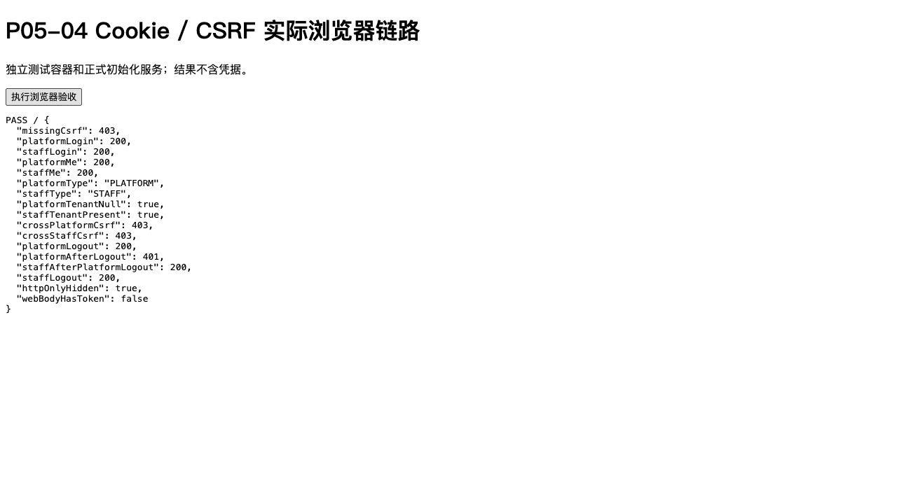

# P05-04 平台管理员身份与控制面认证验证

日期：2026-10-08；根目录 `/Users/kimwell/work/pet-platform`；后端基础包 `com.pet.platform`。用户明确授权本任务；不使用Product Delivery OS，不自动执行下一任务，不提交、推送或部署。状态：**P05-04 COMPLETE；P05整体 IN_PROGRESS**。结论限于下述本机正式实现和真实测试，不表示生产部署、客户微信认证或完整产品上线。

## 实际前置与保全

已读取AGENTS、README、认证/授权/多租户/模块/配置、IDENTITY/API/OPENAPI-GENERATION、初始化/路线/版本/决策和P05既有报告/验收矩阵，并检查STAFF、Sa-Token Redis、Cookie/CSRF/渠道、密码/凭据版本/撤销/重新确认/记录、CurrentPrincipalProvider、TenantContext、平台Redis、数据库角色/迁移和结构规则。P05-03报告为COMPLETE、328项0失败/错误/跳过；DB代际、行锁、精确旧代际清理、意图补偿、敏感提交前重验实际存在。没有凭任务编号推断通过；最终逐项保留并回归全部328用例。

启动工作区已有P05-03未提交成果；[起始文件哈希](evidence/P05-04/baseline-files.json)用于区分本轮修改和原有成果。未重置工作区，保留ui、历史报告/证据、原数据库卷和V1/V2/原角色脚本。最终[文件清单](evidence/P05-04/file-manifest.json)仅列相对启动工作区的变化；[保全/日志/结构/产物审计](evidence/P05-04/final-audit.json)给出逐项结果。

## 模型、权限与数据库

PlatformAccount由identity拥有、独立pet_control.platform_account表，继承BaseEntity而非TenantScopedEntity；UUID、全局唯一规范化登录名、显示名、密码哈希、ACTIVE/DISABLED、security_version、authorization_version、资源version及毫秒审计。IdentityNames执行strip/ASCII小写/合法字符校验，数据库CHECK/UNIQUE兜底。密码复用冻结PBKDF2服务，保留Unicode/空格/大小写，不trim、归一化或截断，不返回哈希。

平台仅三项明确权限：platform:session:manage、platform:credential:change、platform:redis:operate。前两项控制本人会话/凭据；后一项接已有P04受限平台Redis端口。PlatformScopeGuard要求主体PLATFORM及具体代码，不能只isLogin或根据STAFF角色名放行。没有完整平台RBAC、通配符或租户业务权限。

追加V3和provision-platform-roles.sql；独立pet_control五表全部FORCE RLS。pet_runtime无平台表读取/DML/TRUNCATE、schema CREATE或bootstrap执行，仅七个固定认证/本人安全函数。认证前只按规范化登录名取id/hash/security版本最小候选，无列表/分页/导出/通用SQL。七个运行函数及一个bootstrap函数固定search_path=pg_catalog,pg_temp、全限定表名、撤销PUBLIC EXECUTE，由两个NOLOGIN/非表owner且无SUPERUSER/BYPASSRLS的最小能力owner执行。平台初始化单独pet_platform_bootstrap，登录身份不混租户bootstrap/迁移/owner。应用启动检查实际角色、密码列/表读取、高角色、schema及RLS/TRUNCATE；没有关闭租户RLS或授应用高权限。

[PlatformMigrationIT](evidence/P05-04/verify-final-reports/failsafe-reports/TEST-com.pet.testing.identity.PlatformMigrationIT.xml)从正式V2、已初始化租户升级V3，验证租户数据和V1/V2 checksum保留、无自动平台初始化、五表及函数权限/搜索路径；空库正式三迁移和JPA validate由完整测试通过。没有迁移日常/生产数据库。

## 独立初始化

完整配置/角色/升级顺序见[PLATFORM-BOOTSTRAP](../development/PLATFORM-BOOTSTRAP.md)。项目根目录：

```sh
scripts/backend-identity.sh platform-bootstrap \
  --admin-login '<平台登录名>' --admin-name '<平台显示名>'
```

Console不回显输入；自动化显式加`--password-stdin`，受控stdin或0600文件重定向。独立PET_PLATFORM_BOOTSTRAP_DATABASE_*配置不回退STAFF/运行/迁移凭据。无参数密码、默认密码、环境重置开关、启动自动初始化或公共HTTP bootstrap。

命令只允许全库首次创建一个平台管理员。事务advisory lock、唯一登录名和singleton标记保护并发；账号/三项权限/记录同事务。任意现存账号或标记均拒绝再次创建（包括停用）；重复不重置、不加权限、不提供修复/第二账号后门。成功退出0，重复/失败退出2；提交连接故障无法确认结果时明确核查。

测试通过真实命令/service/JDBC路径建立临时账号；成功、重复、并发唯一、故障全回滚、租户角色拒绝、参数/损坏输入拒绝、普通启动不初始化通过。生产JAR脚本真实stdin进程测试见[命令输出](evidence/P05-04/verify-final-reports/p05-04-bootstrap-command.txt)及[RuntimeIT](evidence/P05-04/verify-final-reports/failsafe-reports/TEST-com.pet.testing.identity.PlatformBootstrapRuntimeIT.xml)。临时密码随机生成且不在argv/日志/报告；没有用户提供实际初始化值，未创建真实本地管理员。

## 接口、Cookie、CSRF与撤销

六个正式平台路径（另有原九个STAFF路径）：

| 方法与路径 | 输入 / 成功data | 授权与副作用 |
| --- | --- | --- |
| GET /api/platform/auth/csrf | 无 / CsrfResult | 公共独立pre或当前设备CSRF，不续闲置 |
| POST /api/platform/auth/login | loginName/password / PlatformCurrentIdentity | 平台CSRF及同源来源；轮换当前平台Token/CSRF、销毁pre，只Set-Cookie |
| GET /api/platform/auth/me | 无 / PlatformCurrentIdentity | platform:session:manage；DB重载、本人清理补偿 |
| POST /api/platform/auth/logout | 无 / null | platform:session:manage、CSRF；只退出当前平台设备 |
| PUT /api/platform/auth/password | currentPassword/newPassword / null | platform:credential:change、CSRF/旧密码确认；全部旧平台设备失效 |
| POST /api/platform/auth/logout-all | currentPassword / null | platform:session:manage、CSRF/旧密码确认；全部旧平台设备失效，不改密码 |

详细请求/错误/频控/CSRF/会话行为由[IDENTITY](../contracts/IDENTITY.md#p05-04-平台正式接口2026-10-08)拥有。平台只有WEB；Sa loginType=platform，实际会话键pet:<env>:platform:platform:*，辅助键pet:<env>:auth:platform:*。STAFF保留旧格式/期限/键；共享SaIdentitySessions和WebCookieSecurity的明确共同语义，未复制整套认证分叉。

平台Cookie独立：生产__Secure-pet_platform_sid/pre，Path=/api/platform/，HttpOnly/Secure/SameSite=Lax、无Domain；local HTTP为pet_dev_platform_sid/pre。认证和MVC使用同一服务端路径，API的编码/矩阵参数别名400拒绝；服务端路径只读取本空间Cookie，无关合法空间Cookie忽略；重复本空间凭据/混载体拒绝，Header/Query不能选loginType。CSRF独立绑定预会话/设备，登录轮换、退出失效；双空间CSRF不可互用，Origin/Referer固定同源、未知来源拒绝、CORS不开放跨源。预会话10分钟、平台绝对8小时/闲置30分钟/最多5设备；维护端点不续闲置。频控原子且空间独立，IP60/5分钟、账号10/15分钟；敏感IP60/5分钟、主体/目标8/5分钟。错误账号/密码/停用统一401；DB/Redis故障503关闭，不当密码错误或降级放行。

敏感事务锁本人行并重验当前密码、状态/安全版本/权限/设备，DB同事务变更凭据（如适用）/安全和资源版本/成功记录/清理意图，提交前再检查。提交后按旧security<cutoff清理；Redis失败时200/PENDING，DB代际仍拒绝所有旧设备，新密码可在恢复后登录，旧清理不删新代际。同UUID STAFF不受影响，登录和改密竞争不能把旧密码签发为新代际有效会话。me/后续安全操作补偿，无后台定时/MQ清理；未再登录主体的物理残留可持续至补偿/自然TTL。当前退出和登录记录跨DB/Redis非原子，503需核查，不能宣称所有失败必回滚。

## 控制面与租户边界、安全记录

PlatformCurrentIdentity准确表达PLATFORM主体/当前权限/会话/期限，tenantId/dataScope必填且仅null，门店恒[]。原STAFF模型tenantId和ScopeData仍必填非空，生成类型按principalType可判别。平台请求不建立TenantContext；无tenant不能解释为全部租户。客户端tenantId无法转换空间或进入租户持久化，STAFF不能访问平台，PLATFORM不能进入租户业务入口。既有TenantTaskExecutor只支持可信租户任务，PLATFORM被拒绝（HTTP按既有租户资源拒绝规则返回404）；没有runAsTenant/impersonate或虚构tenant。

安全事件复用既有固定动作/结果/trace的应用记录语义，新增独立pet_control.platform_security_event作用域，主体固定PLATFORM、不含tenant，匿名失败不虚构actor。登录/退出/改密/全撤销记录主体/目标/动作/结果/时间/trace；本人安全记录随凭据事务提交，失败回滚已验。租户事件表原tenantId约束不放松，租户无平台记录读取。没有密码/哈希/Token/完整Session/CSRF秘密字段；日志只记录安全主体/动作/异常类型与trace。

## 实际命令与证据

[COMMAND-INDEX](evidence/P05-04/COMMAND-INDEX.json)保存每个实际cwd、argv、退出码、时间和日志；各同名json还含输出摘要。使用冻结JAVA_HOME Temurin21.0.12.1、Maven Wrapper3.9.16、Node24.21.0、pnpm10.34.6；精确依赖事实源VERSION-MATRIX不变。单独系统java探针读到Zulu21.0.10，保留system-java-version证据；实际Wrapper/JUnit运行用冻结JAVA_HOME，未修改全局环境。

| cwd（相对根目录） | 实际命令 | 最终退出码 / 证据 |
| --- | --- | --- |
| apps/backend | ./mvnw clean verify | 0；[verify-third](evidence/P05-04/verify-third.json)，132单元+234集成=366项，0失败/错误/跳过 |
| . | pnpm contracts:generate | 0；[generate](evidence/P05-04/contracts-generate-final.json)，实际HTTP导出并生成五份产物/严格类型检查 |
| . | pnpm contracts:check | 0；[check](evidence/P05-04/contracts-check-final.json)，重新导出比对 |
| . | pnpm contracts:typecheck | 0；[api-contracts](evidence/P05-04/contracts-typecheck.json) |
| . | pnpm --filter @pet/admin-web typecheck | 0；[Web](evidence/P05-04/web-typecheck.json) |
| . | pnpm --filter @pet/wechat-miniprogram typecheck | 0；[小程序](evidence/P05-04/miniprogram-typecheck.json) |
| . | pnpm check:repo | 0；[结构](evidence/P05-04/repo-check.json) |
| apps/backend | java --class-path <冻结测试依赖与编译类> /tmp/P05PlatformBrowserHarness.java | 0；[临时浏览器后端](evidence/P05-04/browser-harness.json)，无生产测试路径 |
| . | node docs/testing/evidence/P05-04/contracts-final-snapshot.mjs | 0；[最终快照一致](evidence/P05-04/contracts-final-snapshot.json) |
| . | python3 docs/testing/evidence/P05-04/final-audit.py | 0；[最终审计](evidence/P05-04/final-audit.json) |

完整XML、正式迁移升级和安全观察保存于[verify-final-reports](evidence/P05-04/verify-final-reports/failsafe-reports/TEST-com.pet.testing.authentication.PlatformAuthenticationIT.xml)，[test-summary](evidence/P05-04/test-summary.json)逐项对比P05-03：328原用例未丢失、新增38。最终JAR哈希/八实体/三正式迁移/七个冻结Sa模块与无测试代码/秘密见[artifact-audit](evidence/P05-04/artifact-audit.json)。没有新依赖或修改前端页面；仅生成类型及纯类型消费。

### 失败与修复历史（不覆盖）

- platform-first退出1：测试导入java.net/java.lang.reflect两种Proxy造成编译歧义，显式反射Proxy修复。
- platform-second退出1及platform-diagnostic退出1：平台匿名CSRF响应使用纳秒Instant违反既有毫秒协议，出现HTTP序列化失败和无效CSRF；改用毫秒Instant。原始日志保留，不将失败记录转换PASS。focused platform-third退出0（33集成+14结构）验证修复。
- verify-first退出0（132+229=361），当时尚未加入最后五项补充测试，不能作为最终366项证据。
- verify-final退出1：新增契约断言误认为PlatformType独立schema，实际为principalType内联enum；只修正测试按真实字段校验。verify-second退出0（366项）；后续路径加固后再以verify-third完整复核。
- browser-harness-first退出1：并行clean删除临时启动依赖编译类，隔离复制编译输出后恢复；无安全PASS结论。browser-outside-path-harness退出0，但初版document.cookie检查页不在Cookie Path内，只证明该页不可见，不能独立证明HttpOnly；最终测试页置于平台路径内重新执行。初次Path内夹具在浏览器执行前主动终止（browser-in-scope-preliminary-harness退出143），将可见性检查移到登录成功且Cookie仍有效时，再启动并通过；所有轮次记录保留。
- encoded-path-probe退出1：真实POST编码路径/api/%70latform/auth/login在没有CSRF时返回200，证实原始URI与MVC解码路径不一致。统一WebCookieSecurity.requestPath和唯一过滤器的服务器路径，API拒绝编码/矩阵参数别名；同一修复覆盖STAFF，不只修平台分支。encoded-path-fixed退出0，平台四种/员工三种别名均400 BAD_REQUEST，正常路径CSRF规则保留；完整verify-third退出0（366项）后关闭；最终契约重新导出/check和浏览器正常登录也再次通过。
- 首次final-audit-command退出1：自引用的final-audit.json在审计结束前尚未写入，发现两条暂不存在链接；创建结果后复核通过，不覆盖首次记录。
- 正式故障注入测试中的数据库/Redis连接错误、失败记录/清理警告和技术异常均是预期反例；只在恢复/拒绝行为有断言时计通过，不删日志、不把异常本身记PASS。

## 真实浏览器与21项测试覆盖

IAB实际页面使用临时正式PostgreSQL/Redis、真实初始化和唯一生产认证适配，不是登录Mock。浏览器同时拥有两域Cookie，浏览器按Path发送对应域凭据；平台/员工me各200及正确主体/null或非空tenant。缺CSRF403、双域CSRF交换各403；平台退出200后平台401、员工仍200，再员工退出200；平台Path内document.cookie不暴露HttpOnly平台Cookie，Web JSON无Token。[实际结果](evidence/P05-04/browser-result.json)、[浏览器夹具源码](evidence/P05-04/browser-harness.java.txt)与截图如下。HTTP客户端另外在同一请求强制携带双Cookie，两个顺序都正确路由。浏览器范围仅本机同源HTTP；生产Secure属性由真实响应属性/共享策略配置测试验证，不代表HTTPS部署验收。



| 用户必测项 | 实际覆盖 |
| --- | --- |
| 1～3 迁移/JPA、初始化成功/重复/并发/回滚、普通启动无初始化 | ApplicationTest、PlatformMigrationIT、PlatformBootstrapRuntimeIT和初始化六个真实路径测试 |
| 4～6 正确登录、错误/停用拒绝、Cookie/真实CSRF | PlatformAuthenticationIT真实HTTP及浏览器；Secure生产策略配置反例 |
| 7～13 STAFF→平台、平台→租户、双Cookie、CSRF跨域、同UUID、无TenantContext、tenantId不能提升 | 真实域Token/Cookie/Guard/持久化与上下文断言；同UUID真实员工登录且平台撤销后仍有效 |
| 14～18 当前退出、改密/全撤销、Redis故障逻辑失效、STAFF不受影响、竞争 | 实际Redis暂停和恢复、测试适配屏障/故障代理、两次改密仅一次提交、旧登录/延迟清理确定性竞争 |
| 19～21 异常上下文/MDC清理、受限角色、无秘密日志/记录 | 复用线程异常清理、真实SQL越权/SET ROLE/列查询拒绝、平台事件列/内容检查及最终产物日志扫描 |

屏障/故障代理仅src/test，不替代正常路径的真实Sa/PG/Redis，也不进入生产JAR。没有用内存数据库、模拟登录或文档检查替代运行验收。

## G01～G15

| 门禁 | 结果 / 主要证据 |
| --- | --- |
| G01 前置身份/凭据机制核对 | PASS / 实际源码和P05-03报告；328原用例逐项回归 |
| G02 平台账号独立 | PASS / V3独立schema表/PlatformAccount，无tenant继承 |
| G03 显式原子可重复检查/无默认秘密 | PASS / 初始化及生产JAR stdin、并发/故障回滚测试 |
| G04 PLATFORM/STAFF认证及Redis隔离 | PASS / 固定StpLogic和键、同UUID/双Cookie/跨域反例 |
| G05 Cookie/CSRF/频控/固定防护 | PASS / 真实HTTP+浏览器、原子并发频控、重新登录轮换；生产TLS仍未验证 |
| G06 平台当前身份无租户旁路 | PASS / 严格DTO、CurrentPrincipal/TenantContext及持久化拒绝 |
| G07 双向接口隔离 | PASS / 真实STAFF Token/Cookie、PLATFORM Cookie和tenantId反例 |
| G08 平台改密/撤销不影响员工 | PASS / 同UUID及普通STAFF会话保留、本人全部旧平台设备失效 |
| G09 Redis故障权威失效 | PASS / DB提交后实际Redis暂停/恢复及PENDING补偿、新代际保护 |
| G10 DB无新增高权限旁路 | PASS / 正式最小角色/函数、RLS、直接表/列/升权/初始化拒绝 |
| G11 真初始化/登录/隔离测试 | PASS / 38项新增真实路径与故障/竞争测试、浏览器 |
| G12 原测试回归 | PASS / 原328+新增38，366项0失败/错误/跳过 |
| G13 OpenAPI/三端类型一致 | PASS / 15路径、生成/check及三端tsc，STAFF非空约束保留 |
| G14 生产无测试身份/秘密 | PASS / JAR隔离/常量扫描、日志/事件安全检查、无真实初始化 |
| G15 文档/限制/证据完整 | PASS / 命令索引、XML/观察/截图/产物审计、门禁和保全 |

门禁等级：设计/命令说明DOCUMENTED；依赖冻结沿用且实际JAR模块RESOLVED；编译和类型COMPILED；表格列出的PG/Redis/HTTP/浏览器场景RUNTIME_VERIFIED。等级不相互代替。

## 未实现、未验证及下一合法边界

没有平台账号管理/邀请、多角色RBAC、重置其他平台账号、完整租户CRUD、跨租户业务读取/导出、模拟登录/冒用、平台小程序Token、微信客户登录、平台异步框架、完整audit查询模块或前端认证页面。生产迁移/角色分配/真实管理员初始化、HTTPS/TLS/代理/跨源、安全秘密/数据库日志配置、Redis ACL/TLS/HA/容量/恢复、远程CI、Windows/Linux和真实微信客户服务/真机均NOT_EXECUTED或NOT_VERIFIED；本机测试不证明它们。部署前置见[平台初始化](../development/PLATFORM-BOOTSTRAP.md)。

P05-04 COMPLETE依据本任务必选门禁通过；P05整体仍IN_PROGRESS，客户正式身份/微信认证和阶段原三身份条件未闭合。按[实际路线](../development/ROADMAP.md#p05-04-当前结果及下一边界2026-10-08)，下一范围是客户身份基础与微信认证；建议拆为P05-05：客户身份基础、微信认证接入及身份阶段验收，尚未授权，需先明确P05/P09/P10边界和真实外部配置。本轮只报告，不执行，不自动推进P06/P07/P09。
